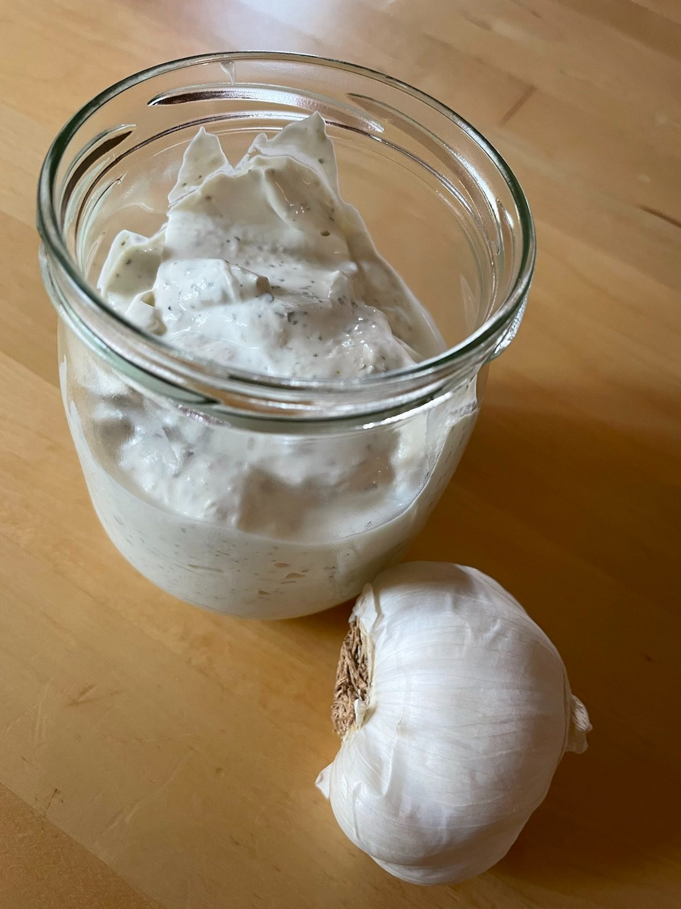

== Knoblauch-Creme
 
**Ein Rezept von Bieke Meller ** +

[frame=none]
[grid=none]
[cols="^5,5"]

|===

|

| ** Zutaten für ein Glas: ** +

ca. 250g Frischkäse +
1 Knoblauchzehe +
Kräuter und Gewürze nach Geschmack +

|===

Den Knoblauch fein reiben und alle Zutaten miteinander verrühren. +
Das ist alles! +

Guten Appetit