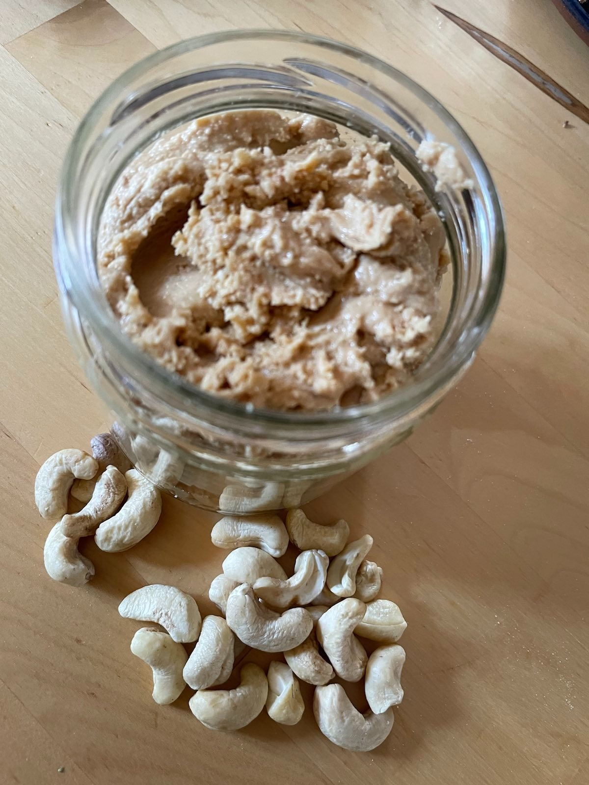

== Nussmus

**Ein Rezept von Bieke Meller ** +

[frame=none]
[grid=none]
[cols="^5,5"]

|===

|

| ** Zutaten: ** +

350g Cashews oder Walnüsse, Mandeln oder eine Mischung davon +

|===

Die Nüsse bei 180°C für 10 Minuten im Backofen anrösten, um das Öl in den Nüssen zu locken. +
Nach dem Abkühlen kommen die Nüsse in den Food-Prozessor oder Hochleistungsmixer und dann geht es rund. +
Das Ganze dauert mindestens 10 Minuten, kann aber auch eine halbe Stunde dauern. Zwischendurch könnte es notwendig werden, alles am Rand klebende zu lösen. +
Zwischendurch entsteht im Behälter ein  kreisender Ball. +
Den Moment, wann sich das Öl aus den Nüssen löst, erkennst Du daran, dass aus dem gummiballartigen Klumpen eine fließende Masse wird. +
Jetzt ist das Mus fertig. +

Guten Appetit