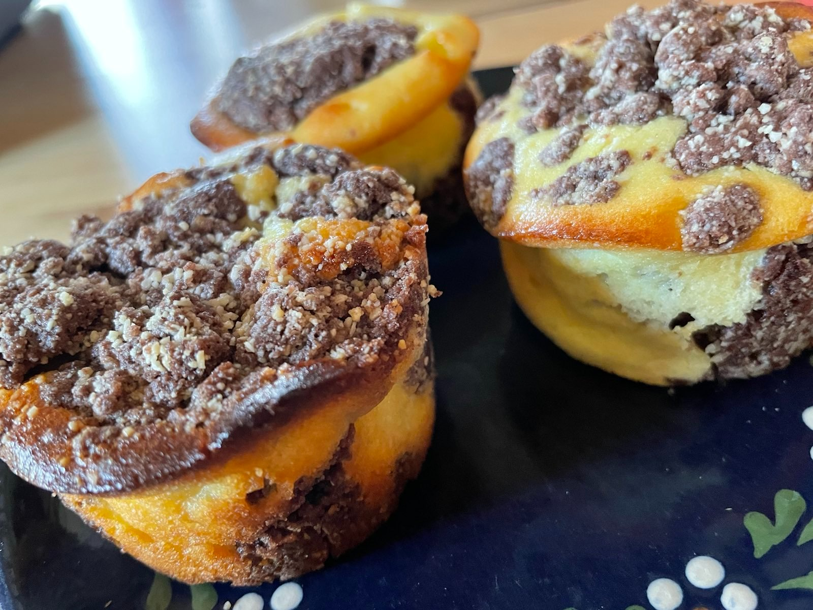

== Russische Quarktorte

**Ein Rezept von Bieke Meller ** +

[frame=none]
[grid=none]
[cols="^5,9"]

|===

| Zutaten für den Teig:

| 350g Mehl +
200g Margarine +
200g Zucker +
1 Ei +
1 Pck Backpulver +
40g Kakao +

|===

[frame=none]
[grid=none]
[cols="^5,9"]

|===

| Zutaten für die Füllung:

| 125g Butter +
250g Zucker +
500g Quark +
3 Eier (Getrennt) +
1 Pck Vanillezucker +
1 Pck Vanillepudding +

|===

Knetteig machen +
Für die Füllung Eiweiß steif schlagen (dann unterheben) +
Teig teilen, eine Hälfte in eine Springform geben +
Quarkfüllung darauf geben +
Die andere Hälfte des Teiges als Streusel darauf verteilen. +

Eine Stunde bei 175°C auf mittlerer Schiene backen.
