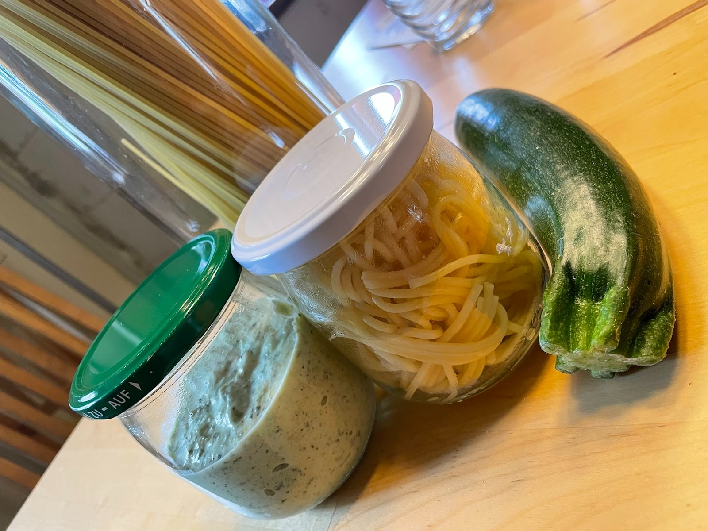

== Spaghetti mit Zucchini-Käse-Creme

**Ein Rezept von Bieke Meller ** +

[frame=none]
[grid=none]
[cols="^5,9"]

|===

| Zutaten pro Person:

| 100g Spaghetti +
100g bis 200g Zucchini +
1 Zwiebel +
1 Tl Olivenöl +
100g Frischkäse +
Salz und Pfeffer nach Geschmack, auch Kräuter und Knoblauch passen sehr gut +
eventuell Parmesan oder anderen Reibekäse als Topping +

|===

Die Zucchini putzen und in kleine Stücke schneiden. +
Wasser für die Nudeln aufsetzen +
Die Zwiebeln klein schneiden und in dem Öl anschwitzen bis sie glasig sind. +
Die Zucchini in den Zwiebeln dünsten bis sie gar sind +
und dann würzen und zusammen mit dem Frischkäse pürrieren bis die Creme leicht schaumig ist. +
In der Zwischenzeit sind die Spaghetti fertig. +

Guten Appetit